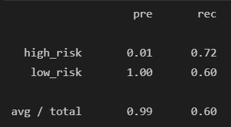
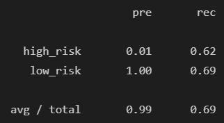
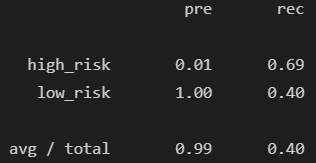
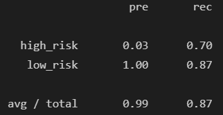
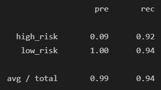

# Credit Risk Analysis Using Supervised Machine Learning

## Overview
The purpose of this analysis is to evaluate several machine learning (ML) algorithms to determine if any of them are suitable for evaluating credit risk based on data about existing loands.  This data includes a number of data features such as current loan status (current, in default, late), loan amount, interest rate, payment amount, total received principle, and many others.  The ratio of good to bad loans is imbalanced in the data, favoring good loans at more than 200:1.  Therefore, all algorithms evaluated use one or more resampling and/or ensemble techniques.

## Results
The following ML algorithms were evaluated using Python 3.7 and scikit-learn:
- Logistic Regression with Random Oversampling
    - Balanced Accuracy:  0.66
    - Precision (pre) is nearly perfect for low risk loans and only 0.01 for high-risk loans
    - Recall (rec) is nominal at 0.72 for high risk and 0.60 for low risk
    

- Logistic Regression with Synthetic Minority Oversampling Technique (SMOTE)
    - Balanced Accuracy:  0.66
    - Precision (pre) is nearly perfect for low risk loans and only 0.01 for high-risk loans
    - Recall (rec) is nominal at 0.62 for high risk and 0.69 for low risk
    

- Logistic Regression with Cluster Centroid Undersampling
    - Balanced Accuracy:  0.54
    - Precision (pre) is nearly perfect for low risk loans and only 0.01 for high-risk loans
    - Recall (rec) is nominal at 0.69 for high risk and low at 0.40 for low risk
    

- Logistic Regression with SMOTE Edited Nearest Neighbor (SMOTEENN)
    - Balanced Accuracy:  0.65
    - Precision (pre) is nearly perfect for low risk loans and only 0.01 for high-risk loans
    - Recall (rec) is nominal at 0.74 for high risk and low at 0.56 for low risk
    

- Balanced Random Forest
    - Balanced Accuracy:  0.78
    - Precision (pre) is nearly perfect for low risk loans and only 0.03 for high-risk loans
    - Recall (rec) is nominal at 0.70 for high risk and high at 0.87 for low risk
    

- Easy Ensemble
    - Easy Ensemble uses bootstrap aggregation and boosting as the ensemble method, and random undersampling for balancing
    - Balanced Accuracy:  0.93
    - Precision (pre) is nearly perfect for low risk loans and only 0.09 for high-risk loans
    - Recall (rec) is high at 0.92 for high risk and high at 0.94 for low risk
    

## Summary
The goal of credit risk analysis is to identify high risk loan applicants so that the loan issuer can minimize their financial risk.  For a classifier algorithm this means that a high recall score for the high risk class is the most important performance metric.  Most of the algorithms evaluated are able to identify high risk loans much better than a coin toss.  However, the Easy Ensemble algorithm provides a much higher recall for high risk loans than any of the others at 0.92.  

In order to minimize the risk to the loan issuer while also offering rapid loan application evaluation, I would recommend the Easy Ensemble algorithm over all others.  It provides good recall for high risk loans while also minimizing the number of low risk loans that are classified as high risk.  The latter can always be forwarded to a human evaluator for further analysis to avoid customer dissatisfaction caused by unnecessary loan rejections.